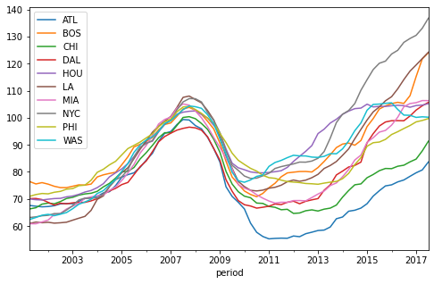
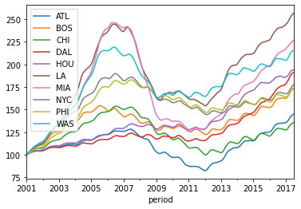
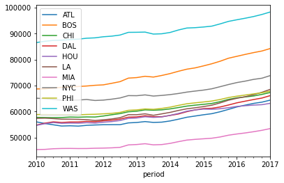
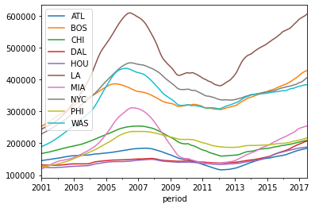
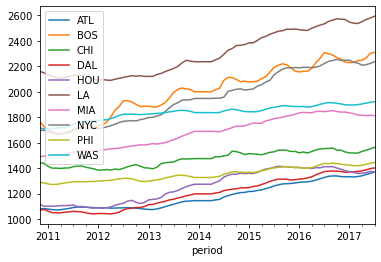
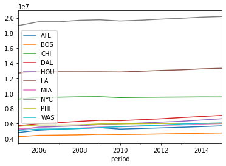
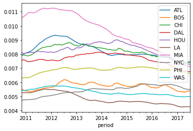
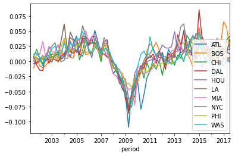

# Step 1b - Data Visualization
- Visualize data to find insights.


```python
import pandas as pd
import numpy as np
import matplotlib.pyplot as plt
%matplotlib inline
```


```python
cpi = pd.read_csv('Q2_cpi.csv', index_col='period', parse_dates = True)
frm30yr = pd.read_csv('Q2_30_Year_FRM.csv', index_col='period', parse_dates = True)
fmhpi = pd.read_csv('Q2_fmhpi.csv', index_col='period', parse_dates = True)
income = pd.read_csv('Q2_zillow_mi_market.csv', index_col='period', parse_dates = True)
hi = pd.read_csv('Q2_zillow_hi_market.csv', index_col='period', parse_dates = True)
hi_zip = pd.read_csv('Q2_zillow_hi_zip.csv', index_col='period', parse_dates = True)
ri = pd.read_csv('Q2_zillow_ri_market.csv', index_col='period', parse_dates = True)
ri_zip = pd.read_csv('Q2_zillow_ri_zip.csv', index_col='period', parse_dates = True)
mkt_pop = pd.read_csv('Q2_market_pop.csv', index_col='period', parse_dates = True)
zip_pop = pd.read_csv('Q2_zipcode_pop.csv')
zip_to_mkt = pd.read_csv('Q2_zip_to_market_corr.csv')
mkt_to_name = pd.read_csv('Q2_market_to_name.csv')
```


```python
mkt_nm = dict(zip(mkt_to_name.name,mkt_to_name.cbsa))

# Create zip to short name mapping
zip_to_nm = dict()
short_nm = ['ATL','BOS','CHI','DAL','HOU','LA','MIA','NYC','PHI','WAS']
i = 0
for k,v in mkt_nm.items():
    mkt_nm[k] = short_nm[i]
    zip_to_nm[str(v)] = short_nm[i]
    i += 1

cpi = cpi.rename(columns=mkt_nm)
```


```python
# CRE price index
cpi.plot(figsize=(8,5))
```


    <AxesSubplot:xlabel='period'>


    

    


```python
frm30yr.plot() # mortgage rate
```


    <AxesSubplot:xlabel='period'>


    

    


```python
fmhpi = fmhpi.rename(columns=zip_to_nm)
fmhpi.plot() # single-family price
```


    <AxesSubplot:xlabel='period'>


    

    


```python
income = income.rename(columns=zip_to_nm)
income.plot() # income
```


    <AxesSubplot:xlabel='period'>


    

    


```python
hi = hi.rename(columns=zip_to_nm)
hi.plot() # housing value
```


    <AxesSubplot:xlabel='period'>


    

    


```python
ri = ri.rename(columns=zip_to_nm)
ri.plot() # rental price
```


    <AxesSubplot:xlabel='period'>


    

    


```python
mkt_pop = mkt_pop.rename(columns=zip_to_nm)
mkt_pop.plot() # population
```


    <AxesSubplot:xlabel='period'>


    

    


```python
# rent to home value
rv = pd.DataFrame(ri.values/hi['2010-11':].values, columns=ri.columns, index=ri.index)
rv = rv.rename(columns=zip_to_nm)
rv.plot()
```


    <AxesSubplot:xlabel='period'>


    

    


```python
cpr = cpi.pct_change()
# cities_cbsa = ['12060', '14460', '16980', '19100', '26420', '31080', '33100', '35620', '37980', '47900']
```


```python
cpr.plot()
```


    <AxesSubplot:xlabel='period'>


    

    


One area has a delay drop in 2010. Let's find out.


```python
cpr['2009':'2010']
```


<div>
<style scoped>
    .dataframe tbody tr th:only-of-type {
        vertical-align: middle;
    }

    .dataframe tbody tr th {
        vertical-align: top;
    }

    .dataframe thead th {
        text-align: right;
    }
</style>
<table border="1" class="dataframe">
  <thead>
    <tr style="text-align: right;">
      <th></th>
      <th>ATL</th>
      <th>BOS</th>
      <th>CHI</th>
      <th>DAL</th>
      <th>HOU</th>
      <th>LA</th>
      <th>MIA</th>
      <th>NYC</th>
      <th>PHI</th>
      <th>WAS</th>
    </tr>
    <tr>
      <th>period</th>
      <th></th>
      <th></th>
      <th></th>
      <th></th>
      <th></th>
      <th></th>
      <th></th>
      <th></th>
      <th></th>
      <th></th>
    </tr>
  </thead>
  <tbody>
    <tr>
      <th>2009-01-01</th>
      <td>-0.055660</td>
      <td>-0.054050</td>
      <td>-0.051677</td>
      <td>-0.048134</td>
      <td>-0.029282</td>
      <td>-0.063844</td>
      <td>-0.039228</td>
      <td>-0.045434</td>
      <td>-0.037638</td>
      <td>-0.056968</td>
    </tr>
    <tr>
      <th>2009-04-01</th>
      <td>-0.109373</td>
      <td>-0.074881</td>
      <td>-0.081223</td>
      <td>-0.086341</td>
      <td>-0.062443</td>
      <td>-0.075157</td>
      <td>-0.046660</td>
      <td>-0.073077</td>
      <td>-0.036109</td>
      <td>-0.062301</td>
    </tr>
    <tr>
      <th>2009-07-01</th>
      <td>-0.048060</td>
      <td>-0.069160</td>
      <td>-0.058549</td>
      <td>-0.055217</td>
      <td>-0.059517</td>
      <td>-0.053166</td>
      <td>-0.044719</td>
      <td>-0.059384</td>
      <td>-0.043193</td>
      <td>-0.076468</td>
    </tr>
    <tr>
      <th>2009-10-01</th>
      <td>-0.030492</td>
      <td>-0.033722</td>
      <td>-0.037517</td>
      <td>-0.047358</td>
      <td>-0.020384</td>
      <td>-0.059627</td>
      <td>-0.072512</td>
      <td>-0.022863</td>
      <td>-0.030330</td>
      <td>-0.039219</td>
    </tr>
    <tr>
      <th>2010-01-01</th>
      <td>-0.035727</td>
      <td>-0.033513</td>
      <td>-0.022701</td>
      <td>-0.021903</td>
      <td>-0.008874</td>
      <td>-0.025046</td>
      <td>-0.016265</td>
      <td>-0.025794</td>
      <td>-0.018134</td>
      <td>-0.007520</td>
    </tr>
    <tr>
      <th>2010-04-01</th>
      <td>-0.079359</td>
      <td>-0.017606</td>
      <td>-0.008268</td>
      <td>-0.006990</td>
      <td>-0.009897</td>
      <td>-0.018448</td>
      <td>-0.012072</td>
      <td>-0.011378</td>
      <td>-0.017371</td>
      <td>0.011235</td>
    </tr>
    <tr>
      <th>2010-07-01</th>
      <td>-0.055403</td>
      <td>-0.011570</td>
      <td>-0.027869</td>
      <td>-0.011686</td>
      <td>-0.003816</td>
      <td>-0.003229</td>
      <td>-0.021465</td>
      <td>0.001467</td>
      <td>-0.012627</td>
      <td>0.017132</td>
    </tr>
    <tr>
      <th>2010-10-01</th>
      <td>-0.026912</td>
      <td>0.017084</td>
      <td>-0.001911</td>
      <td>0.004827</td>
      <td>-0.000527</td>
      <td>0.004137</td>
      <td>-0.017553</td>
      <td>0.010902</td>
      <td>-0.019052</td>
      <td>0.006169</td>
    </tr>
  </tbody>
</table>
</div>


### Atlanta drops 7.9% in Q4/2010!


```python
cpr.corr()
```


<div>
<style scoped>
    .dataframe tbody tr th:only-of-type {
        vertical-align: middle;
    }

    .dataframe tbody tr th {
        vertical-align: top;
    }

    .dataframe thead th {
        text-align: right;
    }
</style>
<table border="1" class="dataframe">
  <thead>
    <tr style="text-align: right;">
      <th></th>
      <th>ATL</th>
      <th>BOS</th>
      <th>CHI</th>
      <th>DAL</th>
      <th>HOU</th>
      <th>LA</th>
      <th>MIA</th>
      <th>NYC</th>
      <th>PHI</th>
      <th>WAS</th>
    </tr>
  </thead>
  <tbody>
    <tr>
      <th>ATL</th>
      <td>1.000000</td>
      <td>0.727017</td>
      <td>0.830039</td>
      <td>0.795288</td>
      <td>0.705069</td>
      <td>0.783648</td>
      <td>0.747051</td>
      <td>0.770125</td>
      <td>0.742701</td>
      <td>0.574516</td>
    </tr>
    <tr>
      <th>BOS</th>
      <td>0.727017</td>
      <td>1.000000</td>
      <td>0.718876</td>
      <td>0.834637</td>
      <td>0.661459</td>
      <td>0.778943</td>
      <td>0.619456</td>
      <td>0.779735</td>
      <td>0.671409</td>
      <td>0.693677</td>
    </tr>
    <tr>
      <th>CHI</th>
      <td>0.830039</td>
      <td>0.718876</td>
      <td>1.000000</td>
      <td>0.806625</td>
      <td>0.694782</td>
      <td>0.834834</td>
      <td>0.790934</td>
      <td>0.782401</td>
      <td>0.796992</td>
      <td>0.711973</td>
    </tr>
    <tr>
      <th>DAL</th>
      <td>0.795288</td>
      <td>0.834637</td>
      <td>0.806625</td>
      <td>1.000000</td>
      <td>0.716978</td>
      <td>0.822873</td>
      <td>0.752660</td>
      <td>0.822497</td>
      <td>0.735887</td>
      <td>0.739047</td>
    </tr>
    <tr>
      <th>HOU</th>
      <td>0.705069</td>
      <td>0.661459</td>
      <td>0.694782</td>
      <td>0.716978</td>
      <td>1.000000</td>
      <td>0.734181</td>
      <td>0.706966</td>
      <td>0.757832</td>
      <td>0.626415</td>
      <td>0.717290</td>
    </tr>
    <tr>
      <th>LA</th>
      <td>0.783648</td>
      <td>0.778943</td>
      <td>0.834834</td>
      <td>0.822873</td>
      <td>0.734181</td>
      <td>1.000000</td>
      <td>0.822593</td>
      <td>0.808557</td>
      <td>0.874232</td>
      <td>0.792138</td>
    </tr>
    <tr>
      <th>MIA</th>
      <td>0.747051</td>
      <td>0.619456</td>
      <td>0.790934</td>
      <td>0.752660</td>
      <td>0.706966</td>
      <td>0.822593</td>
      <td>1.000000</td>
      <td>0.770168</td>
      <td>0.837755</td>
      <td>0.681249</td>
    </tr>
    <tr>
      <th>NYC</th>
      <td>0.770125</td>
      <td>0.779735</td>
      <td>0.782401</td>
      <td>0.822497</td>
      <td>0.757832</td>
      <td>0.808557</td>
      <td>0.770168</td>
      <td>1.000000</td>
      <td>0.723395</td>
      <td>0.757071</td>
    </tr>
    <tr>
      <th>PHI</th>
      <td>0.742701</td>
      <td>0.671409</td>
      <td>0.796992</td>
      <td>0.735887</td>
      <td>0.626415</td>
      <td>0.874232</td>
      <td>0.837755</td>
      <td>0.723395</td>
      <td>1.000000</td>
      <td>0.760509</td>
    </tr>
    <tr>
      <th>WAS</th>
      <td>0.574516</td>
      <td>0.693677</td>
      <td>0.711973</td>
      <td>0.739047</td>
      <td>0.717290</td>
      <td>0.792138</td>
      <td>0.681249</td>
      <td>0.757071</td>
      <td>0.760509</td>
      <td>1.000000</td>
    </tr>
  </tbody>
</table>
</div>


```python
mkt_to_name
```


<div>
<style scoped>
    .dataframe tbody tr th:only-of-type {
        vertical-align: middle;
    }

    .dataframe tbody tr th {
        vertical-align: top;
    }

    .dataframe thead th {
        text-align: right;
    }
</style>
<table border="1" class="dataframe">
  <thead>
    <tr style="text-align: right;">
      <th></th>
      <th>cbsa</th>
      <th>name</th>
    </tr>
  </thead>
  <tbody>
    <tr>
      <th>0</th>
      <td>12060</td>
      <td>Atlanta-Sandy Springs-Marietta, GA Metro Area</td>
    </tr>
    <tr>
      <th>1</th>
      <td>14460</td>
      <td>Boston-Cambridge-Newton, MA-NH Metro Area</td>
    </tr>
    <tr>
      <th>2</th>
      <td>16980</td>
      <td>Chicago-Joliet-Naperville, IL-IN-WI Metro Area</td>
    </tr>
    <tr>
      <th>3</th>
      <td>19100</td>
      <td>Dallas-Fort Worth-Arlington, TX Metro Area</td>
    </tr>
    <tr>
      <th>4</th>
      <td>26420</td>
      <td>Houston-Sugar Land-Baytown, TX Metro Area</td>
    </tr>
    <tr>
      <th>5</th>
      <td>31080</td>
      <td>Los Angeles-Long Beach-Anaheim, CA Metro Area</td>
    </tr>
    <tr>
      <th>6</th>
      <td>33100</td>
      <td>Miami-Fort Lauderdale-Miami Beach, FL Metropol...</td>
    </tr>
    <tr>
      <th>7</th>
      <td>35620</td>
      <td>New York-Newark-Jersey City, NY-NJ-PA Metro Area</td>
    </tr>
    <tr>
      <th>8</th>
      <td>37980</td>
      <td>Philadelphia-Camden-Wilmington, PA-NJ-DE-MD Me...</td>
    </tr>
    <tr>
      <th>9</th>
      <td>47900</td>
      <td>Washington-Arlington-Alexandria, DC-VA-MD-WV M...</td>
    </tr>
  </tbody>
</table>
</div>


